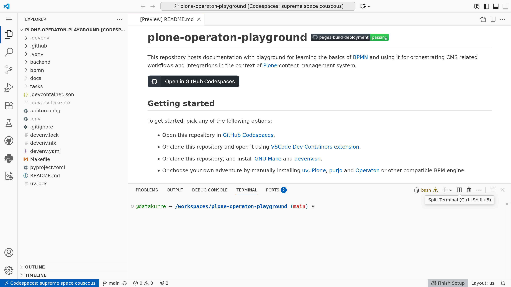

# plone-operaton-playground [](https://datakurre.github.io/plone-operaton-playground)

This repository hosts a playground and documentation for learning BPMN and using it for orchestrating CMS related workflows and integrations with Plone CMS.

[](https://codespaces.new/datakurre/plone-operaton-playground)



## Getting started

To get started, pick any of the following options:

* Open this repository in [GitHub Codespaces](https://codespaces.new/datakurre/plone-operaton-playground).

* Or clone this repository and open it using [VSCode](https://code.visualstudio.com/) [Dev Containers](https://code.visualstudio.com/docs/devcontainers/containers) [extension](https://marketplace.visualstudio.com/items?itemName=ms-vscode-remote.remote-containers).

* Or clone this repository, and install [GNU Make](https://www.gnu.org/software/make/) and [devenv.sh](https://devenv.sh/).

* Or choose your own adventure by manually installing [uv](https://docs.astral.sh/uv/), [purjo](https://pypi.org/project/purjo/) and [Operaton](https://operaton) or other compatible BPM engine.


## Down the rabbit hole

Activate the playground by starting its built-in Operaton build with

```console
$ make start
✔ Building shell in 6.2s.
• PID is 56105
• See logs:  $ tail -f /workspaces/plone-operaton-playground/.devenv/processes.log
• Stop:      $ devenv processes stop
✔ Starting processes in 6.2s.
```

Next, check if `pur`(jo) is already available

```console
$ pur
```

If not, run `make shell` to manually activate the playground `devenv`shell with `uv` and `pur`(jo) pre-installed, and defauld Python virtualenv activated.


## Hello World

Once you have entered the shell with either `make start shell` or separately `make start` and `make shell`, you should be able to try out the following example:

1. Create directory for your bot

   ```console
   $ mkdir hello-world
   $ cd hello-world
   $ pur init
   Adding pyproject.toml
   Adding uv.lock
   Adding Hello.py
   Adding .python-version
   Adding README.md
   Adding hello.robot
   ```

2. Deploy and start the example process

   ```console
   $ pur run hello.bpmn
   Started: http://localhost:8080/operaton/app/cockpit/default/#/process-instance
   ```

3. Serve the example bot

   ```console
   $ pur serve .
   02-02-2025 14:39:49 | INFO | purjo.runner:267 | Subscription | name=My Task
   02-02-2025 14:39:49 | INFO | operaton.tasks.worker:263 | External task worker started.
   ```


## Troubleshooting

### VSCode & Podman

Local VSCode with Podman, might require the following `.devcontainer.json`:

```json
{
  "containerUser": "vscode",
  "customizations": {
    "vscode": {
      "extensions": [
        "bbenoist.Nix",
        "be5invis.toml",
        "charliermarsh.ruff",
        "ms-vscode.makefile-tools",
        "miragon-gmbh.vs-code-bpmn-modeler"
      ]
    }
  },
  "image": "ghcr.io/cachix/devenv:latest",
  "containerEnv": {
    "HOME": "/home/vscode",
    "UV_LINK_MODE": "copy",
    "UV_PYTHON_DOWNLOADS": "never"
  },
  "overrideCommand": false,
  "runArgs": [
    "--userns=keep-id"
  ],
  "updateContentCommand": "devenv test"
}
```

### Curious `devenv` errors

Very occasional and rare errors like the following have been seen:

```console
plone-operaton-playground) vscode ➜ /workspaces/plone-operaton-playground (main) $ make start
devenv processes up -d
• Building processes ...
• Using Cachix: devenv, datakurre
don't know how to build these paths:
  /nix/store/4g8f25hp2yblrhnwd8frmcjfscklb1cc-devenv-up
error:
       error: build of '/nix/store/4g8f25hp2yblrhnwd8frmcjfscklb1cc-devenv-up'
```

This should be fixed by running the following cleanup command

```console
$ make clean
```

and trying again. For example, rebuilding the local devcontainer.
