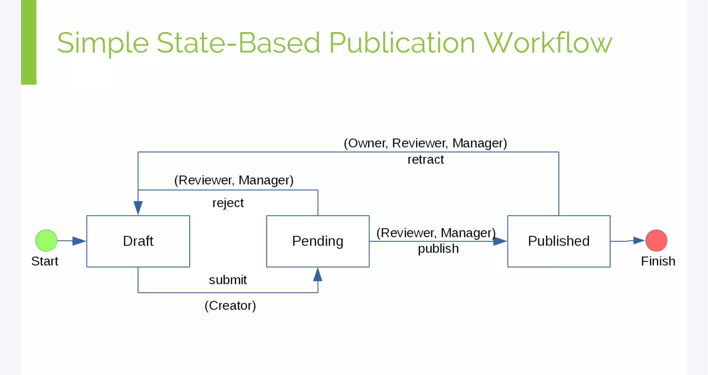
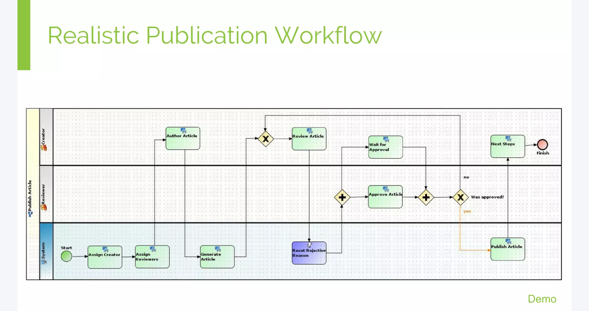

# Foreword

In Plone, we are accustomed to DCWorkflow, a robust state machine engine with its core concepts deeply integrated with the content-centric nature of the CMS. The history of DCWorkflow is told in [Making Workflows Work for You](https://2016.ploneconf.org/talks/making-workflows-work-for-you) by Stephan Richter at Plone Conference 2016.

<iframe src="//www.slideshare.net/slideshow/embed_code/key/J77OsYt93EAbT6" width="595" height="485" frameborder="0" marginwidth="0" marginheight="0" scrolling="no" style="border:1px solid #CCC; border-width:1px; margin-bottom:5px; max-width: 100%;" allowfullscreen></iframe>

## State-based workflows

The problems Stephan highlighted in state-based workflows:

* one process manages single target
* only one state can be maintained at a time.

## Activity-based workflows

From the human perspective, the reality is often more complex:

