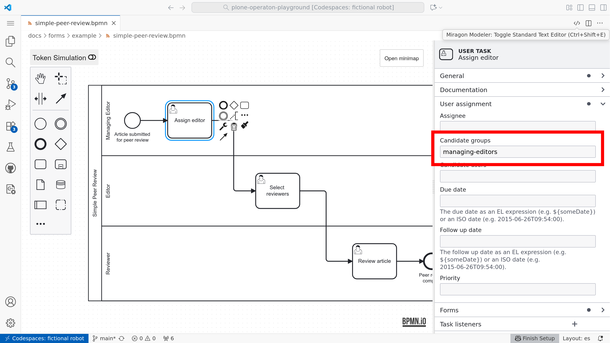
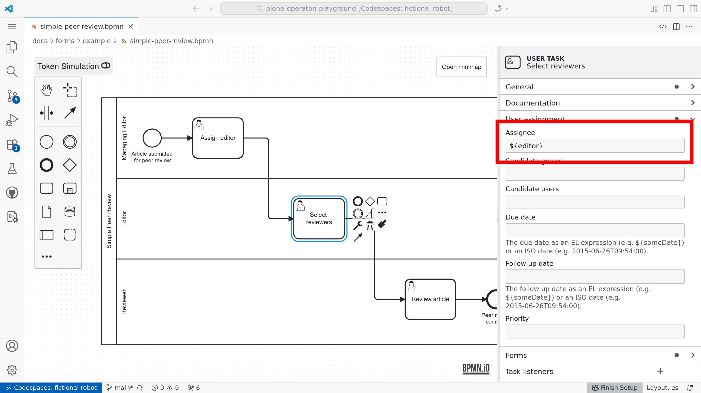
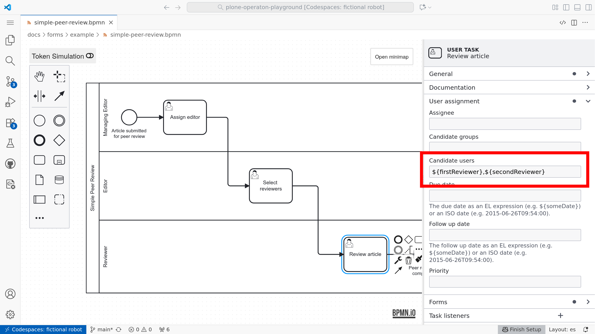
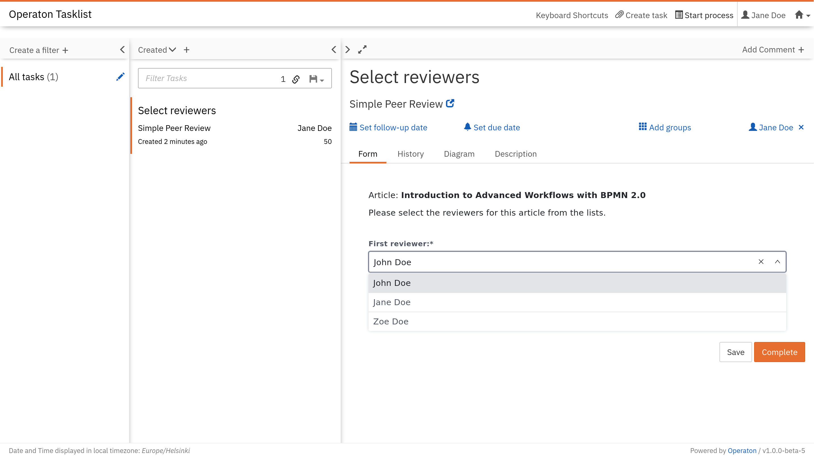

# User tasks and forms

It's about time to bring humans into the loop.


## User tasks

Until now, we have been learning BPMN 2.0 modeling with plain {bpmn}`../bpmn/task` **Undefined task activities**. This is the simplest and most distraction-free way to get started when thinking about your problems in BPMN. Eventually the question arises: who performs those tasks?

The first answer for many processes is usually a person. Tasks completed by humans are called {bpmn}`../bpmn/user-task` **User task**.

Remember the first sequence flow example:

```{bpmn-figure} ../modeling/simple-flow.bpmn
```

With {bpmn}`../bpmn/user-task` user tasks, it would look like:

```{bpmn-figure} simple-flow-user-tasks.bpmn
```

With the modeler, use **Change element** tool (with tool symbol) to change the existing task activities to user task activities.


## Pools

Not all users are equal. It's usual that different persons are responsible to complete different tasks. BPMN 2.0 defines two concepts for grouping user tasks by their respective domain specific user roles: vertical lanes and horizontal pools. Unfortunately, our modeler supports only pools.

This is how our simple example looks with pools:

```{bpmn-figure} review-flow-with-pools.bpmn

{download}`review-flow-with-pools.bpmn`
```

```{warning}
**Pools and lanes are purely visual** — they do not affect how BPMN engines interpret or execute a process.

Many modelers prefer to omit them to keep diagrams cleaner and easier to read; in particular, pools can disrupt a straightforward left‑to‑right “happy path” layout.
```


## Assignments

From this point forward, behavior depends on the process engine used. The Playground provides the free, open-source BPMN and DMN execution engine [Operaton BPM](https://operaton.org/), which is a fork of the discontinued Camunda 7 CE.

In our engine, user tasks are not automatically assigned to the correct users; they must be mapped either using fixed values or variables.


### Properties panel

Although the symbols and flow control are defined by the standard, execution details depend on engine-specific attributes in the model XML. For Operaton, these can be set using the properties panel.


### Candidate groups

Candidate groups are groups of users, who will be able to see, claim and complete the task.




### Assignee user

A task can also be automatically claimed for a single specific user by setting the assignee.




### Candidate users

Candidate users is a list of specific users who will be able to see, claim, and complete the task.




## Forms


The most common way to let an end user complete a user task is to present a form. For external BPMN engines, it’s also common to build custom front‑ends that use familiar or widely adopted form libraries.

With this playground, you will learn to model user task forms with [@bpmn-io/form-js](https://www.npmjs.com/package/@bpmn-io/form-js), a form library maintained by bpmn.io (a project by Camunda). The bpmn.io libraries are distributed under a custom license [bpmn.io/license](https://bpmn.io/license/) that is similar to MIT but requires a visible watermark linking to [bpmn.io](https://bpmn.io).


### Form Playground

The provided component is the practical [form-js-playground](https://www.npmjs.com/package/@bpmn-io/form-js-playground), which is also integrated into our playground:


### Operaton Tasklist

These forms are also supported by default in the current version of Operaton Tasklist:




## Bindings

For historical reasons, bpmn.io forms may still be called "Camunda Forms", as is the case in our modeling tool. Forms are bound to tasks by choosing the type "Camunda Form" and setting the "Form Reference" to the form ID specified in the form editor.


## Demo

The following demo can be deployed into the running playground (after `make start`) with:

```shell
pur operaton deploy docs/forms/example/*
```

```{bpmn-figure} example/simple-peer-review.bpmn
{download}`./example/simple-peer-review.bpmn`
```

### Forms

* Start event: {download}`./example/simple-peer-review.form`
* Assign editor: {download}`./example/simple-assign-editor.form`
* Select reviewers: {download}`./example/simple-select-reviewers.form`
* Review article: {download}`./example/simple-submit-review.form`