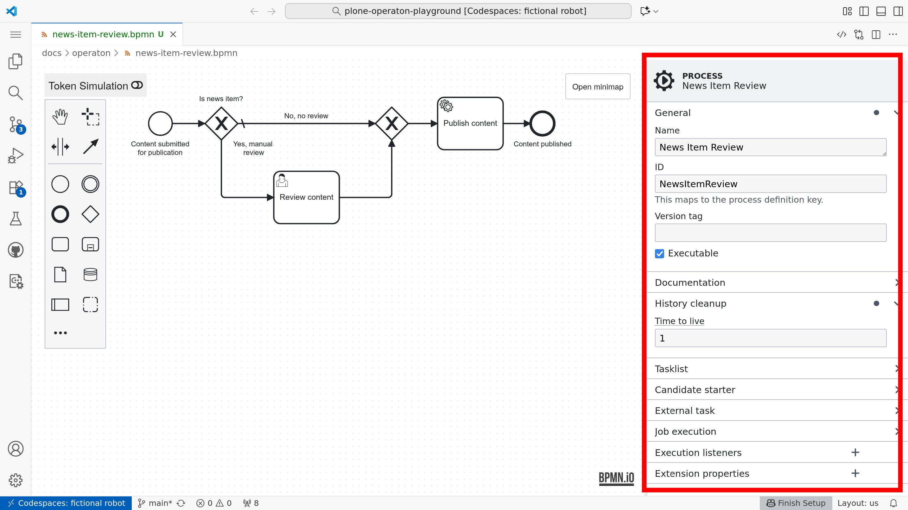
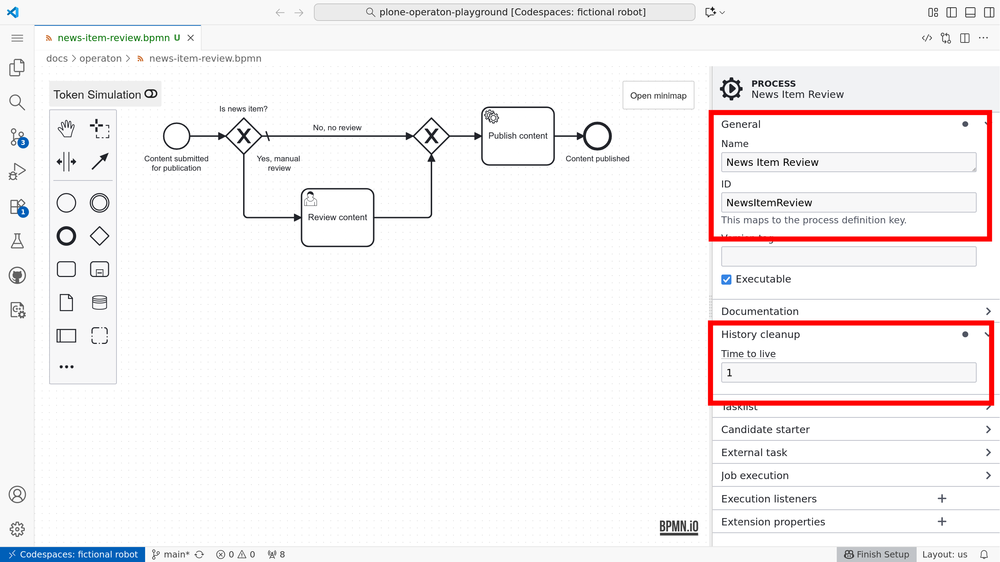
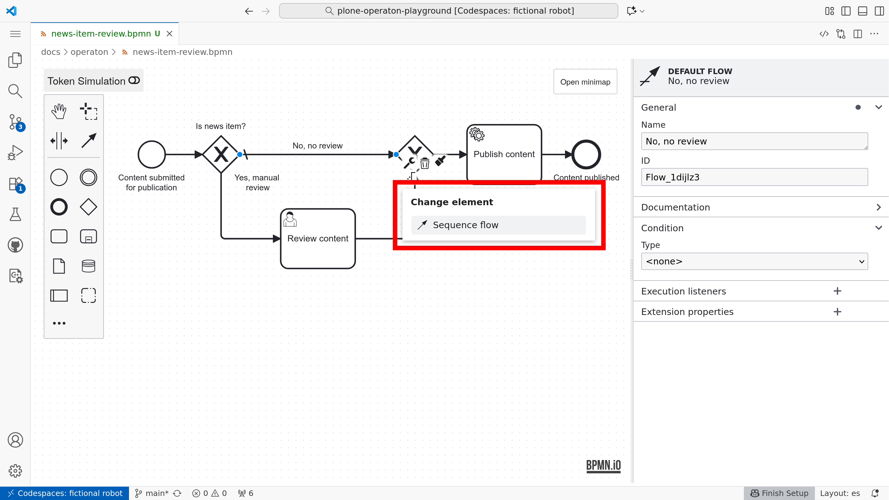
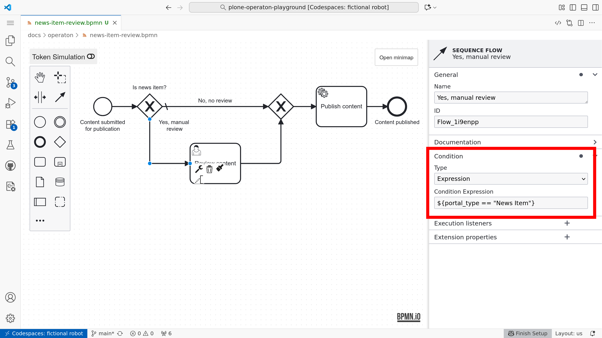
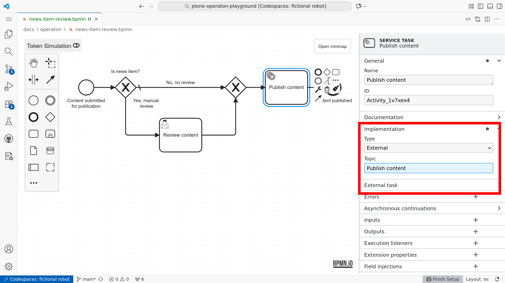
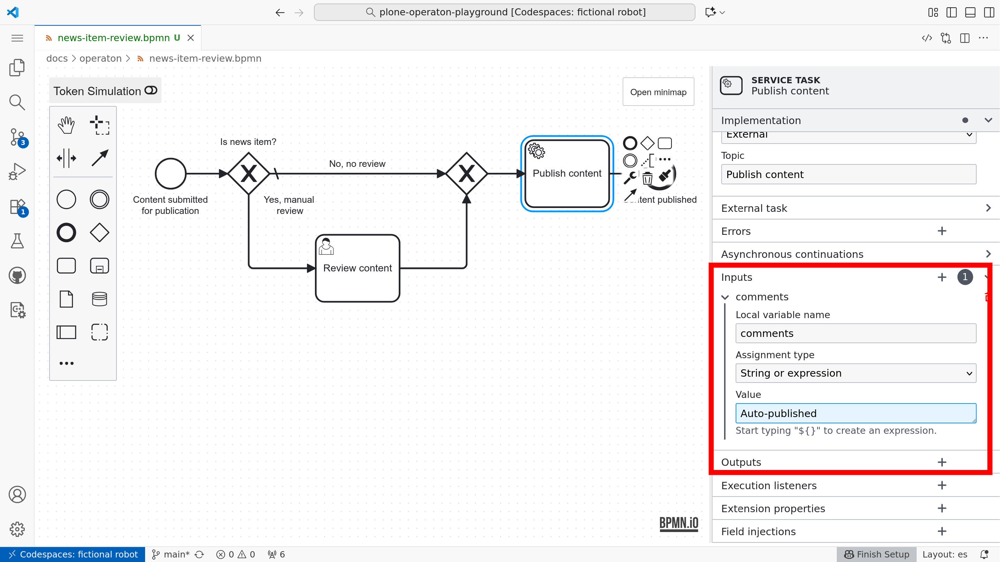

# Modeling for execution

**BPMN is designed** to support business process management **for both business and technical users**. Its visual notation makes models easier to understand than equivalent code while still allowing complex, executable behavior to be modeled.

Although the visual notation is standardized, execution details depend on engine‑specific attributes in the model XML. For Operaton, these can be set in the properties panel.



```{tip}
In the playground, you can create a new BPMN file with `pur operaton create hello-world.bpmn` in the terminal and then open the created file in the editor.
```


## Process name and ID

Every BPMN 2.0 model (process definition) intended for execution should have a descriptive display **Name**, a unique definition **ID**, and the **Executable** option checked. These process-level settings are available in the properties panel when no element is selected.

In Operaton you must also set **Time to live** to define when historical execution data of completed processes may be cleaned up.



```{note}
When using pools, the process Name and ID should be set on the Pool element.
```


## Gateway paths

Execution instructions include how {bpmn}`../bpmn/exclusive-gateway` **Exclusive Gateways** and {bpmn}`../bpmn/inclusive-gateway` **Inclusive Gateways** determine which outgoing path a token should follow.

One of the outgoing paths from an Exclusive Gateway can be configured as **the default path** using the element context modeling palette.



All other outgoing paths should have **condition expressions** defined, using [the expression language](../bpmn/juel.md).




## User tasks

{bpmn}`../bpmn/user-task` **User Tasks** are tasks performed by humans. They model interactions between a process and its users.

In practice, {bpmn}`../bpmn/user-task` **User Tasks** are implemented by presenting the user with a form (e.g. via a custom task list application). The form can display process variables and allow the user to update them. The **filled form is submitted back to the engine** via its API.

[Read more about user task and forms...](../forms/index.md)

## External task pattern

An **External** {bpmn}`../bpmn/service-task` **Service Task** delegates work to be performed outside the engine, such as calling external services or performing long‑running operations. The playground supports implementing external tasks either with Robot Framework or in Python.

To configure an external task in your BPMN model:

1. **Add a {bpmn}`../bpmn/service-task` Service Task** to your process diagram.

2. **Set Implementation** in the properties panel to `External`.

3. **Specify Topic**. Define a topic name that external workers will subscribe to. This acts as a queue for tasks that workers will fetch and complete.



External task workers (like `pur`(jo)) will poll the Operaton REST API for tasks with the specified topic, execute the required work, and report completion back to the engine.

```{tip}
In the playground, a [dedicated plugin](https://github.com/datakurre/camunda-modeler-robot-plugin) renders a {bpmn}`../bpmn/robot-task` **robot icon** for any {bpmn}`../bpmn/service-task` **Service Task** whose *ID* contains the word *robot*.
```

## Inputs and outputs

```{note}
**Inputs and outputs** are an advanced concept. Feel free to skip this section until you are comfortable executing processes using only process‑level variables.
```


**Process variables** store data that can be accessed and manipulated throughout the lifecycle of a process instance. In addition to process‑level variables, the Operaton engine supports nested **variable scopes**. These scopes are most often managed with **input and output mappings** for {bpmn}`../bpmn/task` tasks and {bpmn}`../bpmn/start-event` sub‑processes.

Use of **inputs and outputs is optional**, but they enable separation of generic reusable service tasks with generic "arguments" from domain‑specific process variables. They also reduce the risk of concurrent tasks overwriting each other's process variables.

To configure input and output mappings for a {bpmn}`../bpmn/service-task` **Service Task**, select the task in the modeler and use the **Inputs** and **Outputs** sections in the properties panel.



The default expression language for input mappings in Operaton is [JUEL](../bpmn/juel.md). It allows you to reference process variables and perform simple operations on them.

```{warning}
Variables mapped in {bpmn}`../bpmn/service-task` **Service Task** inputs are only available within the task. Once the task completes, they are no longer accessible **unless they are exported via outputs**.
```

```{tip}
**Inputs and outputs** can map domain‑specific process‑level variables to generic task‑level variables, enabling **generic, reusable external task workers**. This is analogous to how functions are defined and invoked in traditional programming.
```

```{tip}
File variables need to be mapped with the special expression `${execution.getVariableTyped("name")}`; otherwise they may be coerced to the generic "Bytes" variable type.
```

