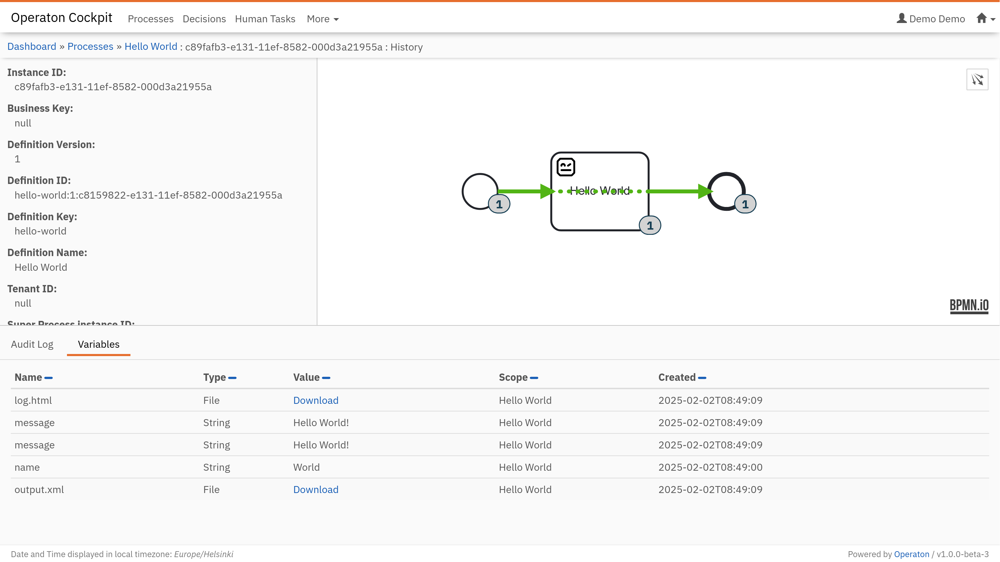

# Plone Operaton Playground

[Plone Operaton Playground](https://github.com/datakurre/plone-operaton-playground) is a [VSCode](https://code.visualstudio.com/) [Dev Container](https://code.visualstudio.com/docs/devcontainers/containers) based development environment that supports [GitHub Codespaces](https://codespaces.new/datakurre/plone-operaton-playground). It can also be run locally with the VSCode [extension](https://marketplace.visualstudio.com/items?itemName=ms-vscode-remote.remote-containers). For adventurers, the [README](https://github.com/datakurre/plone-operaton-playground#getting-started) also mentions more manual setups.

Technically, the playground is just a git repository containing both this documentation and the development environment configuration. There are a lot of files, but don't be afraid of them.

## Terminal

Using the playground requires substantial use of the terminal because the main tools used, [`uv`](https://docs.astral.sh/uv/) and [`pur`(jo)](https://pypi.org/project/purjo/) are all command line tools. In addition, the playground includes [`robot`](https://robotframework.org/) to support Robot Framework based task automation.

A new terminal can be launched using the shortcut `Ctrl+Shift+S` or `Cmd+Shift+S`. Alternatively, it can be found from the menu `Terminal > New Terminal`. Or with editor command `> Terminal: Create New Terminal`.

If the terminal does not start with the default Python virtual environment `(plone-operaton-playground)` activated, it should be activated by typing the command `make shell` into each new terminal.

## Operaton

BPMN-driven orchestration requires a BPM engine capable of executing BPMN models. The playground provides a preconfigured [Operaton](https://operaton.org/) BPM engine, which is a Java-based open-source BPM engine, forked from the popular Camunda 7 CE.

The current version is `1.0.0-beta5` with JSON support ("SPIN") and the currently required [UI plugin for displaying process instance histories](https://github.com/datakurre/operaton-cockpit-plugins).

Operaton is started from the terminal in the background with the command `make start`. Once started, the editor will prompt you to open the Operaton UI in a new browser tab. The playground username is `admin` and the password is `admin`.

If you need to see the console output of Operaton, you can attach to its monitor with `make start-monitor`.

The raw `devenv` command to start Operaton and attach the monitor all at once in the same terminal is `devenv up`.

## Miranum Modeler

For creating and editing BPMN 2.0 and DMN diagrams for Operaton, the playground provides fork of the [Miranum Modeler](https://marketplace.visualstudio.com/items?itemName=miragon-gmbh.vs-code-bpmn-modeler) extension preinstalled. Any `.bpmn`, `.dmn` or `.form` file opened will be automatically opened in the modeler.

Miranum Modeler is based on free, source-available [BPMN.io](https://bpmn.io/) libraries, whose license requires the BPMN.io logo to be displayed in the bottom right corner of the modeler.

The extension is missing a command for creating new diagrams, but you can create new files in the terminal with the command `pur bpm create` and then open them in the modeler.

## `uv`

[`uv`](https://docs.astral.sh/uv/) is an extremely fast Python package and project manager, written in Rust. It is a single tool that replaces most of the existing Python packaging and virtual environment tools.

The default Python virtual environment in the playground is managed with `uv`. New packages can be installed into it using the command `uv pip install`. Later, `uv` is also used for managing custom Robot Framework test/task suite package dependencies with its `uv add` command, and for executing them with the `pur`(jo) tool.

If `uv` is not available in the terminal, it should become available with the command `make shell` in the terminal.

## `pur`(jo)

[`pur`(jo)](https://pypi.org/project/purjo/) is a *work-in-process* tool for managing and executing Python and Robot Framework test / task suite packages for BPMN-driven orchestration.

We'll cover more about `pur`(jo) in the another section of this documentation.

## RobotCode

Another extension preinstalled in the playground is [RobotCode](https://marketplace.visualstudio.com/items?itemName=robotframework.robotframework). It's the famous extension adding Robot Framework IntelliSense, linting, test execution and debugging, code formatting, refactoring, and many more features right into the editor.

RoboCode features are available in any `.robot` file opened in the editor.

RobotCode requires a Python virtualenv with the `robotframework` package preinstalled. The playground provides one right at `.venv` to support the autodiscovery in the editor. If the virtualenv is missing for some reason, try `make shell` in the terminal to recreate it.

